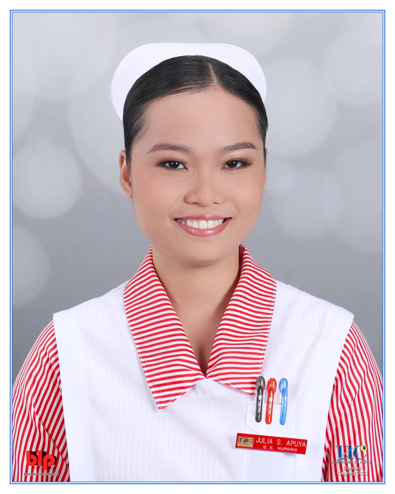
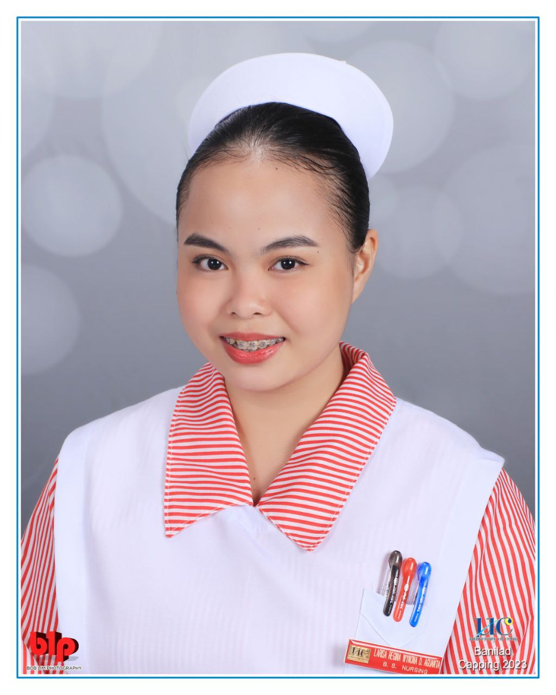
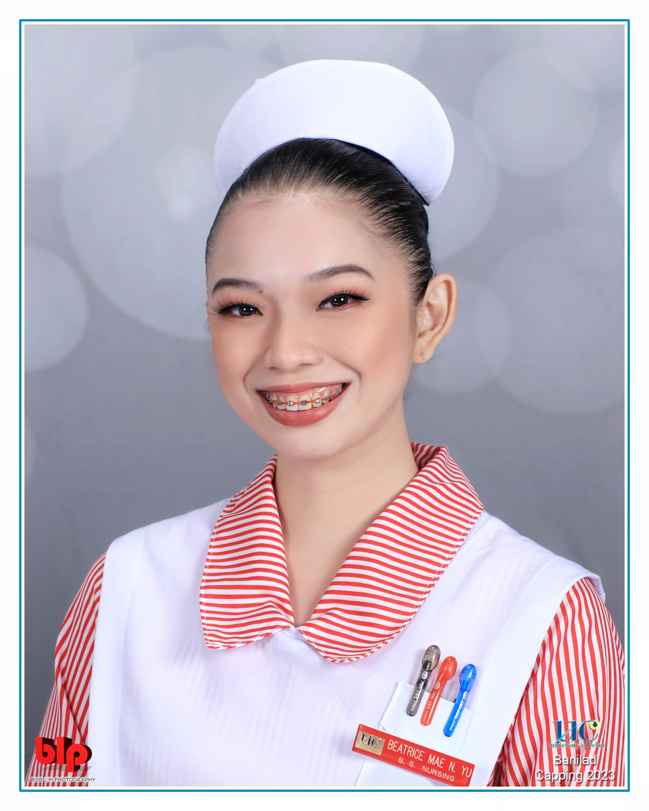
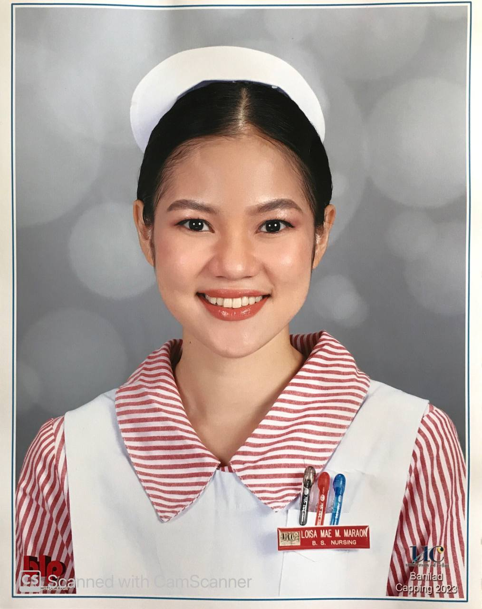
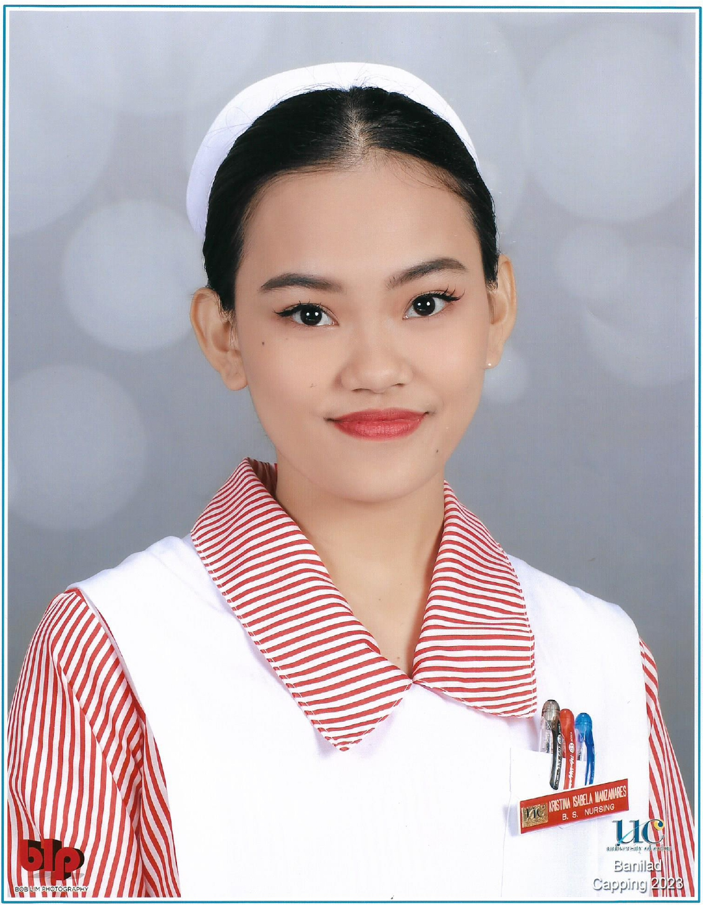
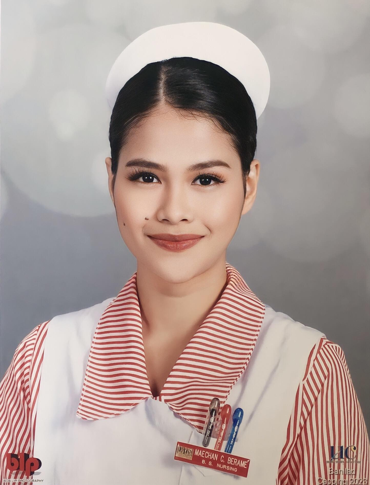
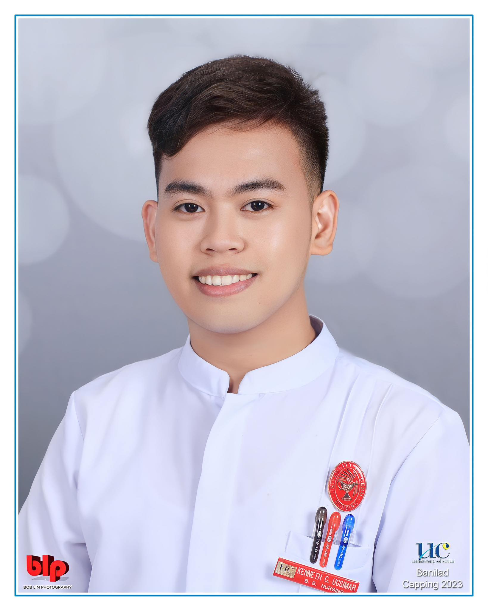
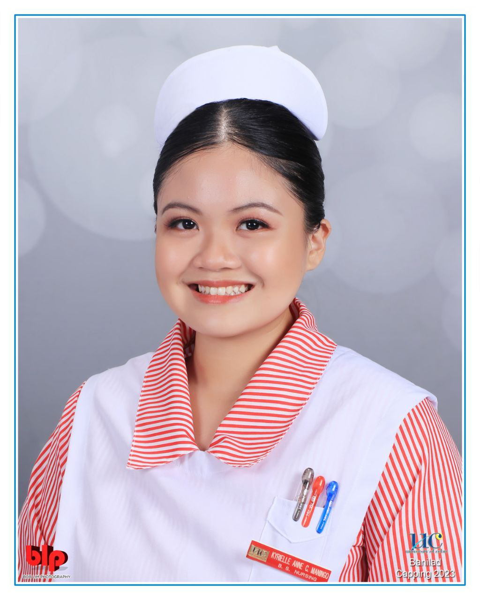
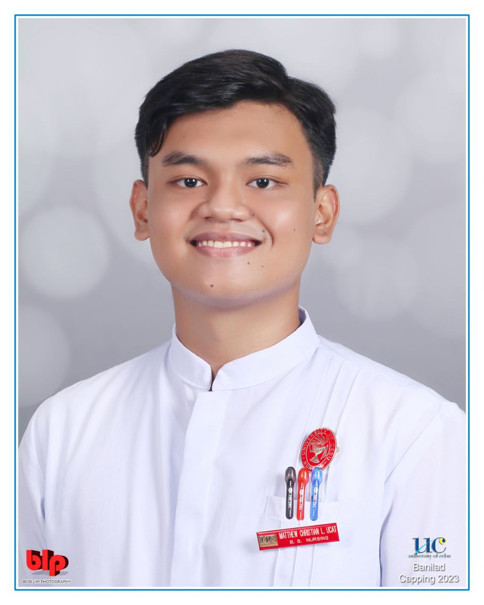
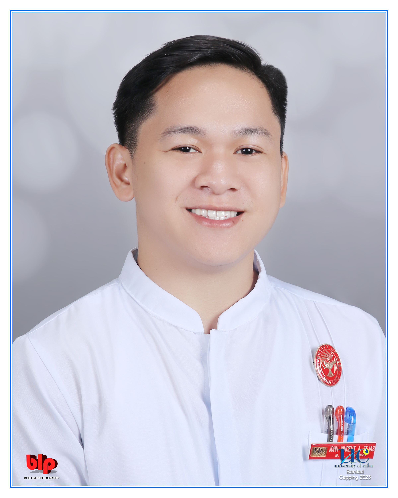

# BSN 3G Class Officers Roster

<mark style="color:blue;">**President:**</mark> Leads and represents the class, oversees class activities, and communicates with faculty and administration on behalf of the class.

* <mark style="background-color:red;">**Class President - Julia Apuya**</mark>
  * 

<mark style="color:blue;">**Internal Vice President:**</mark> Assists the President in their duties and takes over in their absence.

* <mark style="background-color:red;">**Class Internal Vice President - Keith Arcilla**</mark>
  * 

<mark style="color:blue;">**External Vice President:**</mark> Manages external relationships, such as collaborating with other sections or student organizations.

* <mark style="background-color:red;">**Class External Vice President - Larisa Wynona Regina Aguanta**</mark>
  * 

<mark style="color:blue;">**Secretary:**</mark> Handles administrative tasks, records minutes of meetings, and communicates important information to the class.

* <mark style="background-color:red;">**Class Secretary - Beatrice Mae Yu**</mark>
  * 

<mark style="color:blue;">**Treasurer:**</mark> Manages class funds and budgets, keeps accurate financial records.

* <mark style="background-color:red;">**Class Treasurer - Loisa Mae Maraon**</mark>
  * 

<mark style="color:blue;">**Auditor:**</mark> Ensures transparency and accuracy in financial matters.

* <mark style="background-color:red;">**Class Auditor - Kristina Isabela Manzanares**</mark>
  * 

<mark style="color:blue;">**PROs or PIO:**</mark> Handles communication, promotes class events, and maintains the class's public image.

* <mark style="background-color:red;">**Class Public Relations Officer - Maechan Berame**</mark>
  * 
* <mark style="background-color:red;">**Class Public Relations Officer - Kenneth Ugsimar**</mark>
  * 

<mark style="color:blue;">**Sergeant at Arms:**</mark> Maintains order during class meetings and events, upholds discipline and respect.

* <mark style="background-color:red;">**Class Sergeant-at-Arms - Kyrielle Anne Maningo**</mark>
  * 
* <mark style="background-color:red;">**Class Sergeant-at-Arms - Matthew Christian Ucat**</mark>
  * 

**Miscellaneous:**

* <mark style="background-color:red;">**Class Prince - John Vincent Tejas**</mark>
  * 
* <mark style="background-color:red;">**Class Muse - Trisha Angeli Laytani**</mark>
  *
