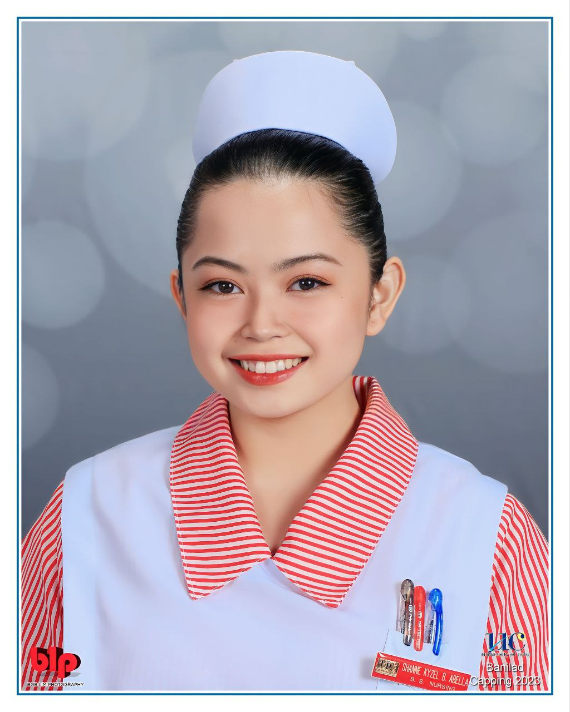

# BSN 3G Class Officers Roster

<mark style="color:blue;">**President:**</mark> Leads and represents the class, oversees class activities, and communicates with faculty and administration on behalf of the class.

*   <mark style="background-color:red;">**Class President - Keith Clarence Arcilla**</mark>

    <figure><figcaption></figcaption></figure>

<mark style="color:blue;">**External Vice President:**</mark> Manages external relationships, such as collaborating with other sections or student organizations.

*   <mark style="background-color:red;">**Class Internal Vice President - Larisa Wynona Regina Aguanta**</mark>

    <figure><figcaption></figcaption></figure>

<mark style="color:blue;">**Internal Vice President:**</mark> Assists the President in their duties and takes over in their absence.

*   <mark style="background-color:red;">**Class External Vice President -**</mark>&#x20;

    <figure><figcaption></figcaption></figure>

<mark style="color:blue;">**Secretary:**</mark> Handles administrative tasks, records minutes of meetings, and communicates important information to the class.

*   <mark style="background-color:red;">**Class Secretary - Beatrice Mae Yu**</mark>

    <figure><figcaption></figcaption></figure>

<mark style="color:blue;">**Treasurer:**</mark> Manages class funds and budgets, keeps accurate financial records.

*   <mark style="background-color:red;">**Class Treasurer - Jefferson Ang**</mark>

    <figure><figcaption></figcaption></figure>

<mark style="color:blue;">**Auditor:**</mark> Ensures transparency and accuracy in financial matters.

*   <mark style="background-color:red;">**Class Auditor - Roger Joshua Atis**</mark>

    <figure><figcaption></figcaption></figure>

<mark style="color:blue;">**PROs or PIO:**</mark> Handles communication, promotes class events, and maintains the class's public image.

*   <mark style="background-color:red;">**Class Public Relations Officer - Mary Grace Amba**</mark>

    <figure><figcaption></figcaption></figure>
*   <mark style="background-color:red;">**Class Public Relations Officer - Angel Franz Villarampa**</mark>

    <figure><figcaption></figcaption></figure>

<mark style="color:blue;">**Sergeant at Arms:**</mark> Maintains order during class meetings and events, upholds discipline and respect.

*   <mark style="background-color:red;">**Class Peace Officer - Julia Apuya**</mark>

    <figure><figcaption></figcaption></figure>
*   <mark style="background-color:red;">**Class Peace Officer - Josemarialen Quijada**</mark>

    <figure><figcaption></figcaption></figure>

**Officers-of-the-Day Respective Leaders:**

_<mark style="color:red;">Lumina Leaders</mark>_&#x20;

*   <mark style="background-color:red;">**Lumina One - (OPEN)**</mark>

* <mark style="background-color:red;">**Lumina Two - Dille Marie Derder**</mark>

<figure><figcaption></figcaption></figure>

_<mark style="color:orange;">**Nexus Leaders**</mark>_&#x20;

* <mark style="background-color:red;">**Nexus One - (OPEN)**</mark>
* <mark style="background-color:red;">**Nexus Two - Joyce Angelica Cimacio**</mark>

<figure><figcaption></figcaption></figure>

_<mark style="color:blue;">Optima Leaders</mark>_&#x20;

* <mark style="background-color:red;">**Optima One - (OPEN)**</mark>
* <mark style="background-color:red;">**Optima Two - Lyka Armentano**</mark>

<figure><figcaption></figcaption></figure>

_<mark style="color:green;">Pinnacle Leaders</mark>_&#x20;

* <mark style="background-color:red;">**Pinnacle One - Miara Kyna Zea Tubo**</mark>

<figure><figcaption></figcaption></figure>

* <mark style="background-color:red;">**Pinnacle Two - Samantha Juliet Arreglo**</mark>

<figure><figcaption></figcaption></figure>

_<mark style="color:purple;">Vigor Leaders</mark>_&#x20;

* <mark style="background-color:red;">**Vigor One - Kimberly Bontilao**</mark>

<figure><figcaption></figcaption></figure>

* <mark style="background-color:red;">**Vigor Two - Princess Juliana Marie Cairo**</mark>

<figure><figcaption></figcaption></figure>
